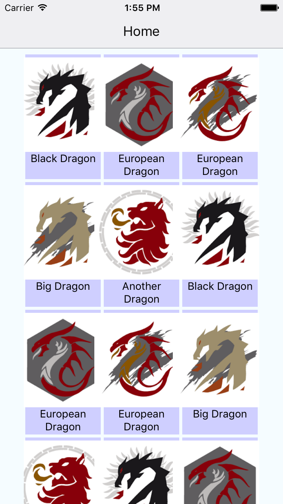

# ReactNativeImageGridExample
A Basic example to create an Image grid and navigate to individual items.

## Screens



## Concepts Used

* [ScrollView](http://facebook.github.io/react-native/releases/0.31/docs/using-a-scrollview.html)
* [Navigation using react-native-router-flux](https://github.com/aksonov/react-native-router-flux)

## Setup
First make sure your machine is ready to compile react-native applications : http://facebook.github.io/react-native/releases/0.31/docs/getting-started.html

Then run the below commands

```
$ git clone https://github.com/sravanrekandar/ReactNativeImageGridExample.git
$ cd ReactNativeImageGridExample
$ npm install

# To run ios app
$ react-native run-ios

# To run android app
$ react-native run-android
```
